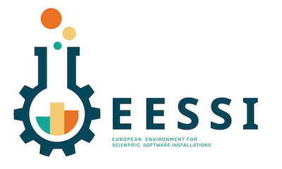

# Overview of the EESSI project

## Scope & Goals

Through the EESSI project, we want to set up a **shared stack of scientific software installations**, and by doing so avoid a lot of duplicate work across HPC sites.

For end users, we want to provide a **uniform user experience** with respect to available scientific software, regardless of which system they use.

Our software stack should work on laptops, personal workstations, HPC clusters and in the cloud, which means we will need to support different CPUs, networks, GPUs, and so on.
We hope to make this work for any Linux distribution and maybe even macOS and Windows via [WSL](https://docs.microsoft.com/en-us/windows/wsl/), and a wide variety of CPU architectures (Intel, AMD, ARM, POWER, RISC-V).

Of course we want to focus on the **performance** of the software, but also on automating the workflow for maintaining the software stack, thoroughly testing the installations, and collaborating efficiently.

## Inspiration

The EESSI concept is heavily inspired by Compute Canada software stack,
which is a shared software stack used on all 5 major national systems in Canada
and a bunch of smaller ones.

The design of the Compute Canada software stack is discussed in detail
in the PEARC'19 paper [*"Providing a Unified Software Environment for Canada’s
National Advanced Computing Centers"*](https://ssl.linklings.net/conferences/pearc/pearc19_program/views/includes/files/pap139s3-file1.pdf).

It has also been presented at the 5th EasyBuild User Meetings ([slides](https://users.ugent.be/~kehoste/eum20/eum20_03_maxime_computecanada.pdf), [recorded talk](https://www.youtube.com/watch?v=_0j5Shuf2uE&list=PLhnGtSmEGEQidEM8MZKkOaVutgt9WmqI0)), and is [well documented](https://docs.computecanada.ca/wiki/Accessing_CVMFS).

## Layered structure

The EESSI project consists of 3 layers.

The bottom layer is the [**filesystem layer**](filesystem_layer),
which is responsible for distributing the software stack across clients.

The middle layer is a [**compatibility layer**](compatibility_layer.md),
which ensures that the software stack is compatible with multiple different
client operating systems.

The top layer is the [**software layer**](software_layer.md), which contains the actual scientific software applications and their dependencies.

The host OS still provides a couple of things, like drivers for network and GPU, support for shared filesystems like GPFS and Lustre, a resource manager like Slurm, and so on.

## Opportunities

We hope to collaborate with interested parties across the HPC community,
including HPC centres, vendors, consultancy companies and scientific software developers.

Through our software stack, HPC users can seamlessly hop between sites,
since the same software is available everywhere.

We can leverage each others work with respect to providing tested and
properly optimized scientific software installations more efficiently,
and provide a platform for easy benchmarking of new systems.

By working together with the developers of scientific software we can provide
vetted installations for the broad HPC community.

## Challenges

There are many challenges in an ambitious project like this, including (but probably not limited to):

* Finding time and manpower to get the software stack set up properly;
* Leveraging system sources like network interconnect (MPI & co), accelerators (GPUs), ...;
* Supporting CPU architectures other than x86_64, including ARM, POWER, RISC-V, ...
* Dealing with licensed software, like Intel tools, MATLAB, ANSYS, ...;
* Integration with resource managers (Slurm) and vendor provided software (Cray PE);
* Convincing HPC site admins to adopt EESSI;

## Current status

*(June 2020)*

We are actively working on a pilot setup that has a limited scope,
and are organizing monthly meetings to discuss progress and next steps forward.

Keep an eye on our GitHub repositories at [https://github.com/EESSI](https://github.com/EESSI) and our [Twitter
feed](https://twitter.com/eessi_hpc).
